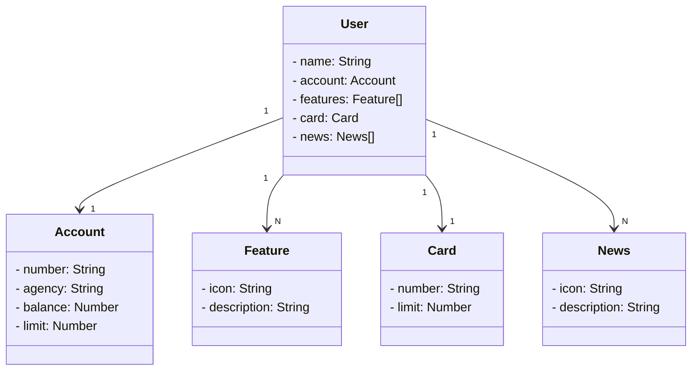

# Project Java Api

Criação Java RESTful API

- Project as part of <a href="https://web.dio.me/">DIO</a> Bootcamp FullStack - Java + Angular

## 🛠 Tecnologias
- Java 17
- Spring Boot 3
- Spring Data JPA
- OpenAPI (Swagger)
- Railway

## Class Diagram

